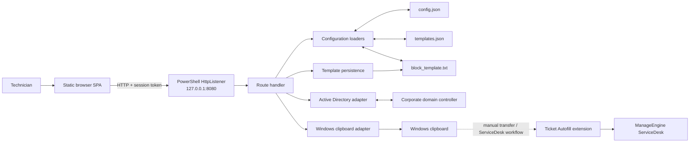
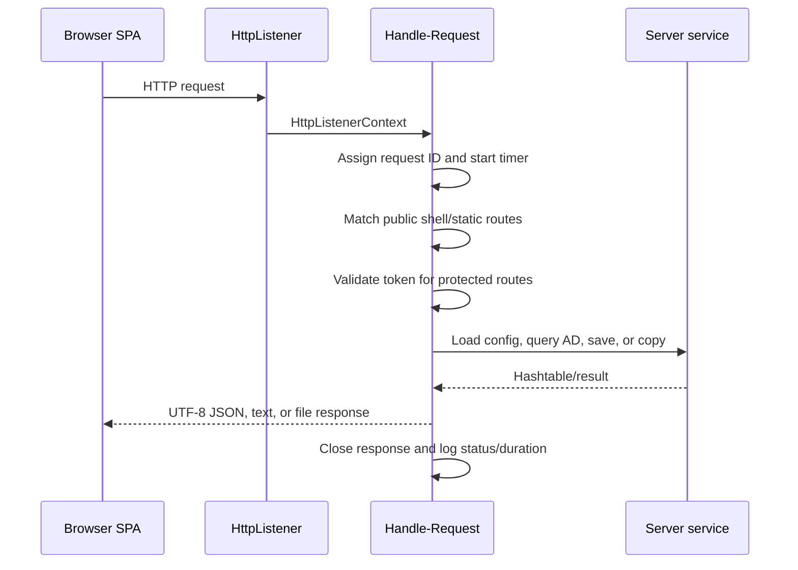

# Server architecture

## Purpose

The PowerShell server is a small local bridge between the browser application and capabilities that a static webpage cannot safely access on its own:

- the corporate Active Directory;
- the Windows clipboard;
- configuration and template files on disk;
- persistent diagnostic logging.'

The reason for this split is simple: Have the freedom in stylings of HTML, CSS, JS with the CLI capabilities.

The browser remains responsible for presenting the interface, building ticket content, previewing Markdown, and analyzing exported tickets. The extension later converts the generated Markdown subset into sanitized rich HTML when it fills ServiceDesk. The server does not render forms or contain a second copy of the frontend's form structure. It serves the application and exposes a narrow local API for the operations that require Windows or filesystem access.

This separation is why the application can remain a static HTML/CSS/JavaScript SPA without a framework while still performing operations that normal browser security rules prohibit.

## High-level design



The extension is not hosted by, and does not call, the PowerShell server. It is a separate unpacked browser extension that consumes the generated JSON through the clipboard when the ServiceDesk workflow reaches that machine. This is because the only way to interact with the server, ideally is through the SPA

## Why this architecture?

The design deliberately uses the smallest practical components for the environment:

1. **`HttpListener` provides a local HTTP origin.** The SPA can use ordinary `fetch()` calls instead of browser-specific filesystem or fancy PowerShell integrations.
2. **The listener is bound only to `127.0.0.1`.** Other machines cannot connect to port 8080 through this listener, so the server is not exposed as a LAN web service.
3. **A per-run token protects the API.** The startup URL carries a newly generated 24-character token. The frontend reads it and includes it in every API request. Without the token, the server will not respond. 
4. **PowerShell supplies the Windows integration layer.** The ActiveDirectory module performs directory lookups, and `System.Windows.Forms.Clipboard` writes to the interactive Windows clipboard.
5. **The frontend is configuration-driven.** `/api/config` sends the field definitions, dropdowns, mappings, preset templates, technician's name, and output block to the SPA. Most customization therefore requires editing data rather than application code.
6. **Runtime files remain beside the application.** Paths are resolved from `$PSScriptRoot`, so launching the script from another working directory does not make it read or write the wrong files.

It is best understood as a local desktop utility that happens to use a browser for its interface; not as a conventional multi-user web server.

## Component responsibilities

### `server.ps1`

The process owner and local integration layer. It:

- starts and stops the HTTP listener;
- generates the session token;
- routes requests;
- loads and normalizes configuration;
- queries Active Directory;
- writes text to the Windows clipboard;
- saves the customized output block;
- serializes responses as UTF-8 JSON;
- records diagnostics in `server.log`.

### `web/index.html`

The current Markdown/rich-text SPA. It extracts the token from the startup URL, requests `/api/config`, builds the interface, processes user input, and calls the server APIs when it needs privileged local behavior.

### `web/index_legacy.html`

The previous plain-text shell. It uses the same server and API contract and is available at `/legacy` as a fallback.

### `config.json`

The canonical runtime configuration and version source. It defines fields, dropdowns, AD properties and mappings, quick actions, the technician name, and the full/display versions.

### `templates.json`

The ticket preset map. A preset can define its Category, Subcategory, Item, ticket type, topic, Situation template, Process template, and custom placeholder values.

### `block_template.txt`

The technician's customized outer ticket layout. It is created when the Template Editor saves. If it does not exist or cannot be read, the server uses its built-in default block.

### `server.log`

An append-only runtime diagnostic log. All log levels are written to this file even when the server is running in quiet mode (ie. not verbose). Request bodies and clipboard contents are deliberately excluded to keep it a bit cleaner.

## Startup lifecycle

When `server.ps1` starts, it performs these operations in order:

1. Reads the optional `-Verbose` switch.
2. Loads `System.Windows.Forms` and configures UTF-8 console output.
3. Resolves all application paths relative to the script directory.
4. Initializes logging, request counters, and the quiet-mode status display.
5. Loads `config.json`, `block_template.txt`, and `templates.json`, falling back to built-in defaults when necessary.
6. Creates an `HttpListener` with the single prefix `http://127.0.0.1:8080/`.
7. Generates a new 24-character token for this process.
8. Prints the authenticated current and legacy URLs in the startup banner.
9. Opens the current application URL in the default browser.
10. Enters the request loop until the process is stopped.

The token is intentionally ephemeral. Restarting the server invalidates URLs from the previous process, so the complete URL printed by the current server must be used. This makes it so that if you don't open the URL with the current token, it will not connect. 

## Request lifecycle



Each accepted request receives an ID such as `req-00001`. That ID follows the request through loader, API, serialization, and error logs, making one operation traceable even in a long `server.log`.

The response helpers own the complete response lifecycle: they encode the body, set status and content headers, write the output stream, and close the response in a `finally` block. Closing each response deterministically is important because an abandoned `HttpListenerResponse` can leave the browser waiting for a body that will never finish.

## Routing and authentication

| Route | Protection | Responsibility |
|---|---:|---|
| `GET /` or `/index.html` | Public on localhost | Serves the current rich-text shell |
| `GET /legacy` or `/index_legacy.html` | Public on localhost | Serves the previous shell |
| `GET /web/*` | Public on localhost | Serves static assets while rejecting paths containing `..` |
| `GET /favicon.ico` | Public on localhost | Returns `204 No Content` before the token gate |
| `GET /api/config` | Token | Reloads and returns frontend configuration |
| `GET /api/ad` | Token | Finds one AD user by username or display name |
| `POST /api/template` | Token | Saves `block_template.txt` as UTF-8 |
| `POST /api/clipboard` | Token | Copies supplied text to the Windows clipboard |

The HTML shell must be reachable before authentication so the browser can load it. The server still opens it with `?token=...`; JavaScript reads that parameter and the shared API wrapper sends the token both as a query parameter and as the `X-Token` header. Everything below the route handler's token gate rejects a missing or incorrect value with HTTP 403.

The favicon route also has to remain above the gate. Browsers request `/favicon.ico` independently and do not reliably copy the page's query string. Returning an empty 204 prevents that automatic request from being treated as a failed authenticated API call.

The token is a lightweight capability for a localhost utility, not a replacement for user authentication, TLS, or operating-system access controls. Anyone who can read the active URL or the server console can use the local API while that server process is running.

## Configuration loading and hot reload

There are three independent loaders:

- `Load-Config` parses `config.json`, clones the built-in defaults, and overlays every supplied top-level setting.
- `Load-TemplateMap` parses `templates.json` into a consistent ordered preset map.
- `Load-BlockTemplate` reads the saved output block or returns the built-in block.

They run once during startup, then run again every time the frontend requests `/api/config`. This is the hot-reload mechanism: edit a configuration file and refresh the browser; no PowerShell restart is required.

The route assigns the refreshed objects to `$script:Config`, `$script:TemplateMap`, and `$script:BlockTemplate`. The explicit script scope is significant. Without it, PowerShell would create variables local to `Handle-Request`, and later routes—especially `/api/ad`—could continue using the stale startup configuration.

If a configuration file is absent or invalid, its loader logs the exception and returns its built-in default. This keeps the interface available for recovery instead of terminating the server because of one malformed customization file.

### Dropdown compatibility

`Normalize-Dropdowns` accepts both the old array form and the current object form:

```json
{
  "status": ["Open", "Closed"]
}
```

```json
{
  "status": {
    "label": "Status",
    "outputKey": "_status",
    "options": ["Open", "Closed"]
  }
}
```

This normalization creates one stable structure for the frontend while allowing older personal configurations to continue loading.

### Why `ReadAllText` matters

Configuration and template files are read with `[System.IO.File]::ReadAllText(...)`, not `Get-Content -Raw`.

I ran into lots of bugs and found out that in Windows PowerShell 5.1, the FileSystem provider can decorate values returned by `Get-Content` with PowerShell extended properties such as `PSPath`, `PSDrive`, and `PSProvider`. If the saved block is later included in the `/api/config` response, `ConvertTo-Json` may recursively walk that metadata. The result can appear to hang while serializing `blockTemplate` or `templateMap`. This was the bug in v3.5

`ReadAllText` returns a plain `System.String`, so JSON serialization sees only the template text. This is the reason the saved `block_template.txt` can now be loaded and returned reliably after a server restart.

## Active Directory flow

`GET /api/ad` accepts either `?user=` or `?name=`: (still waiting for AL & Phone number lookups)

1. The server imports the ActiveDirectory module.
2. For a username, it first attempts `Get-ADUser -Identity`, which is efficient for an exact account name.
3. If that fails, it searches `SamAccountName` or a matching `UserPrincipalName`.
4. For a name search, it searches `Name` and `DisplayName` and chooses the first result.
5. Only properties listed in `config.json -> adProperties` are requested and returned.
6. The response includes `_mapping`, copied from `adMapping`, so the browser knows which configured field receives each AD property.

Filter values have embedded single quotes escaped before they are inserted into the AD filter expression. The server logs the query type and character count, not the searched username or name.

Although the HTTP listener itself is localhost-only, an AD lookup naturally communicates with the corporate domain through the ActiveDirectory module. “Local-only” describes who can call this server; it does not mean the domain lookup occurs without network traffic.

## Template persistence flow

The Template Editor posts JSON containing a `template` string to `/api/template`. The server:

1. forces UTF-8 while decoding the request body;
2. validates that the `template` property exists;
3. rejects content over 262,144 characters;
4. writes `block_template.txt` as UTF-8 without a byte-order mark;
5. updates the in-memory `$script:BlockTemplate` immediately;
6. returns `{ "ok": true }`.

The next `/api/config` request reads the same file again. As a result, the edit survives page refreshes and server restarts without introducing a database.

Ticket presets are different: they are loaded from `templates.json`. The current server does not expose an endpoint that rewrites that file, so persistent preset changes are made by editing the JSON itself.

## Clipboard flow

The browser cannot write arbitrary rich ticket data to the operating-system clipboard in every environment or browser permission state. `/api/clipboard` gives it a predictable local fallback:

1. the SPA serializes plain ticket text, a tendency report, or autofill JSON into the request's `text` property;
2. the server decodes the request as UTF-8;
3. empty values are rejected;
4. `System.Windows.Forms.Clipboard.SetText()` writes the value to Windows;
5. the API returns a success or error result.

Clipboard content is never written to `server.log`; only its character count and timing are recorded.

The server writes plain clipboard text; it does not create an HTML clipboard payload. Markdown remains part of the generated text/JSON, and the ServiceDesk extension converts the supported Markdown syntax to sanitized HTML when it writes into ServiceDesk's rich-text iframe.

## Encoding strategy

UTF-8 is forced at every boundary because ticket templates contain Spanish characters, Unicode separators, symbols, and emoji:

- console output uses UTF-8;
- JSON and text responses declare UTF-8 and are encoded explicitly;
- request bodies are decoded with a UTF-8 `StreamReader` rather than relying on `HttpListener.ContentEncoding`;
- the output template is saved as UTF-8 without a BOM;
- configuration files are read explicitly as UTF-8.

The explicit request decoding is important because a client may send `Content-Type: application/json` without a `charset`. In that case, `HttpListener` can otherwise fall back to a Windows ANSI code page and corrupt Unicode before JSON parsing even begins.

## Request loop and concurrency

The listener uses `GetContextAsync()`, but request processing is intentionally serial:

```text
accept one context -> handle it completely -> accept the next context
```

The async wait exists so quiet mode can animate the status line and Ctrl+C can be noticed roughly every 120 milliseconds. It does not make `Handle-Request` concurrent.

Serial handling is appropriate for one technician using one local browser and avoids synchronization problems around shared script variables and the clipboard. The tradeoff is that a slow AD lookup, slow disk operation, or stalled response delays every request queued behind it. Supporting multiple simultaneous users would require a different concurrency model and synchronization around mutable state.

## Failure containment and diagnostics

Failure handling exists at several levels:

- each loader falls back to defaults;
- each response helper catches write/close failures;
- each API route converts expected problems into JSON errors;
- `Handle-Request` records unhandled route failures with the active request ID;
- the outer loop catches a failed request and continues accepting the next one;
- the final shutdown block stops and closes the listener.

In normal mode, the console shows warnings, errors, and a compact live status line. With `-Verbose`, it shows the complete diagnostic stream. `server.log` always receives DEBUG through ERROR entries regardless of console mode.

Logs intentionally describe structure rather than sensitive payloads. They record paths, sizes, timings, response keys, and operation outcomes but do not record request bodies, clipboard contents, or AD query text.

## Security boundary

I'm not a Cybersecurity professional nor am I trying to be. The current safeguards were a simple idea I had for the intended use of single-user VDI workflow:

- the listener binds to the IPv4 loopback address only;
- privileged API routes require a fresh per-process token;
- static asset traversal containing `..` is rejected;
- only a small fixed route set is implemented;
- templates have a size limit;
- no general-purpose command or arbitrary file API is exposed;
- diagnostic logs omit ticket and clipboard bodies.

The server intentionally does not provide HTTPS (didn't want to bother with certificates), account authentication, role separation, or multi-user isolation. Those features would add complexity without improving the current one-person, one-machine use case. If the listener is ever changed from `127.0.0.1` to a LAN address, this security model must be redesigned drastically.

## Current constraints

- Windows is required for `System.Windows.Forms.Clipboard` and the intended AD tooling.
- Corporate domain access and the ActiveDirectory PowerShell module are required for lookups.
- Port 8080 must be available. (It does NOT switch to another port)
- Only one request is processed at a time. (shouldn't be an issue)
- The server keeps current configuration in process-wide script variables.
- The token is exposed in the browser URL and startup console by design.
- There is no database (yet), background service, installer, or automatic update mechanism.
- The two ServiceDesk extensions are installed separately and must not be enabled together.

These are conscious boundaries of a lightweight local tool. The architecture can grow later, but its present strength is that it remains inspectable, portable within the VDI, and operable with PowerShell plus a browser.

## Historical evolution

The project began as a personal, fixed-format ticket form in HTML. Early I noticed that I really was just using it as a more "limiting notepad". This made me explore into more "script" based approach as I was incorporating the Get-ADUser command but needed a GUI. This GUI was obv, very ugly cuz winforms is not very flexible. I took some time to figure out if i leaned to the powershell approach (ugliness at the price of usability with AD Lookups) or SPA (good looking but lack AD Lookups). Eventually I thought: "what about having a shell server..." and this is the end product. I kept expanding it through versions, adding new features while still thinking: "how can other people use it and suit their styles" which lead to becoming more configuration-driven as more technicians needed different field layouts and writing styles. Presets moved into `templates.json`, the outer ticket block became persistable, dropdowns became data-defined, and the current shell added Markdown editing with sanitized rich-HTML clipboard output (this was just cuz I think good looking tickets improve readability).

The server stayed deliberately small throughout that evolution. Instead of becoming a template engine or UI framework, it became the stable boundary beneath both the current and legacy shells: serve files, provide configuration, perform Windows-only operations, and keep those operations observable through logs. 
